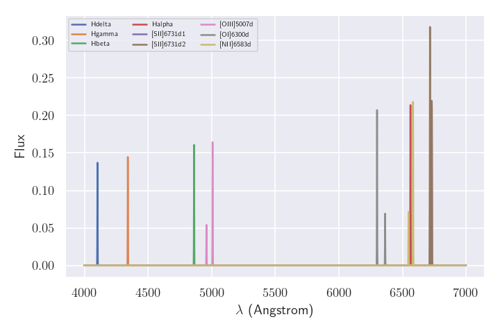
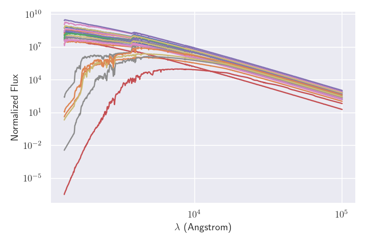

The basic paintbox classes
==========================

The spectral energy distribution (SED) of galaxies can be decomposite
into different parts, such as the light from the stars, the emission
lines from the gas, and the attenuation of the light as a whole owing to
dust absorption. Similarly, ``paintbox`` uses different ingredients to
build a model for the SED that com be combined to produce a SED model.
Here we describe the main classes used for this purpose.

Non-parametric models
~~~~~~~~~~~~~~~~~~~~~

Often the components in the SED can be modeled as a combination of
templates, and this method have been extensively explored by some tools
such as ```ppxf`` <https://pypi.org/project/ppxf/>`__ and
```Starlight`` <http://www.starlight.ufsc.br/>`__. One instance is the
modeling of emission lines, which we use below to produce some templates
with the built-in tools from ``ppxf``.

::

    import os
    import numpy as np
    import astropy.units as u
    from astropy.modeling import models
    import matplotlib.pyplot as plt
    import paintbox as pb
    from paintbox import utils
    from ppxf import ppxf_util, miles_util
    
    # Generating an wavelenght array spaced logarithmically with
    # fixed velocity scale
    wrange = [4000, 7000]
    velscale = 30 # Velocity shift between pixels
    FWHM = 2.8 # Resolution of the observation
    
    # Simple tool to get velocity dispersion with fixed velscale within a given range
    wave = utils.disp2vel(wrange, velscale) 
    logwave = np.log(wave)
    
    gas_templates, gas_names, line_wave = ppxf_util.emission_lines(
            logwave, [wave[0], wave[-1]], FWHM,
            tie_balmer=False, limit_doublets=True)
    gas_names = [_.replace("_", "") for _ in gas_names] # Removing underlines from names
    fig = plt.figure(figsize=(8, 6))
    for i in range(len(gas_names)):
        plt.plot(wave, gas_templates[:,i], label=gas_names[i])
    plt.legend(ncol=5, prop={"size": 8})
    plt.xlabel("$\lambda$ (Angstrom)")
    plt.ylabel("Flux")
    plt.show()


.. parsed-literal::

    Emission lines included in gas templates:
    ['Hdelta' 'Hgamma' 'Hbeta' 'Halpha' '[SII]6731_d1' '[SII]6731_d2'
     '[OIII]5007_d' '[OI]6300_d' '[NII]6583_d']





In ``paintbox``, a combination of such templates can be invoked with the
``NonParametricModel`` class, which can be used to produce an SED with
any combination.

::

    # Creating paintbox component
    emission = pb.NonParametricModel(wave, gas_templates.T, gas_names)
    print("Name of the parameters", emission.parnames)
    # Generating some random flux for each emission line
    theta = np.random.random(len(gas_names))
    print("Random fluxes of emission lines: ")
    print(*zip(emission.parnames, theta))
    fig = plt.figure(figsize=(8, 6))
    plt.plot(wave, emission(theta))
    plt.xlabel("$\lambda$ (Angstrom)")
    plt.ylabel("Flux")
    plt.show()


.. parsed-literal::

    Name of the parameters ['Hdelta', 'Hgamma', 'Hbeta', 'Halpha', '[SII]6731d1', '[SII]6731d2', '[OIII]5007d', '[OI]6300d', '[NII]6583d']
    Random fluxes of emission lines: 
    ('Hdelta', 0.3990546446177675) ('Hgamma', 0.3720088069901858) ('Hbeta', 0.6910604161313084) ('Halpha', 0.8516915271249351) ('[SII]6731d1', 0.029682220572311957) ('[SII]6731d2', 0.9276260263988682) ('[OIII]5007d', 0.03600336387628489) ('[OI]6300d', 0.24220613814452097) ('[NII]6583d', 0.49044717730270126)


Parametric models
~~~~~~~~~~~~~~~~~

In several applications, we are interested in the determination of the
parameters involved in the modeling of the SED, for instance, the age or
the metallicity of a stellar population model that better describes some
observations. The ``NonParametricModel``\ class above can be used for
that purpose, of course, but the problem of determining the correct
weights becomes more difficult as we include more templates. One
alternative is thus tointerpolate the models such that we can have a SED
description for any particular combination of parameters within a convex
hull defined by the limits of the model. In this case, we can use the
``paintbox.ParametricModel`` class. In the example below, we use a set
of theoretical stellar models from `Coelho
(2014) <https://ui.adsabs.harvard.edu/abs/2014MNRAS.440.1027C/abstract>`__,
which you can download `here <http://specmodels.iag.usp.br/>`__ to
demonstrate how to use this class.

::

    import os
    
    from astropy.io import fits
    from astropy.table import Table, vstack
    
    models_dir = "s_coelho14_sed"
    # Getting parameters from file names
    model_names = os.listdir(models_dir)
    # Get dispersion from the header of a file
    filename = os.path.join(models_dir, model_names[0])
    crval1 = fits.getval(filename, "CRVAL1")
    cdelt1 = fits.getval(filename, "CDELT1")
    n = fits.getval(filename, "NAXIS1")
    pix = np.arange(n) + 1
    wave = np.power(10, crval1 + cdelt1 * pix) * u.micrometer
    table = []
    templates = np.zeros((len(model_names), n))
    for i, filename in enumerate(model_names):
        T = float(filename.split("_")[0][1:])
        g = float(filename.split("_")[1][1:])
        Z = 0.1 * float(filename.split("_")[2][:3].replace(
            "m", "-").replace("p", "+"))
        alpha = 0.1 * float(filename.split("_")[2][3:].replace(
            "m", "-").replace("p", "+"))
        a = np.array([T, g, Z, alpha])
        t = Table(a, names=["T", "g", "Z", "alpha"])
        table.append(t)
        templates[i] = fits.getdata(os.path.join(models_dir, filename))
    table = vstack(table) # Join all tables in one

::

    # Use paintbox to interpolate models.
    star = pb.ParametricModel(wave, table, templates)
    print("Parameters: ", star.parnames)
    print("Limits for the parameter: ", star.limits)
    theta = np.array([6500, 3., -0.1, 0.1])
    fig = plt.figure(figsize=(8, 6))
    plt.semilogx(wave, star(theta))
    plt.xlabel("$\lambda$ ($\mu$m)")
    plt.ylabel("Flux")
    plt.show()


.. parsed-literal::

    Parameters:  ['T', 'g', 'Z', 'alpha']
    Limits for the parameter:  {'T': (3000.0, 26000.0), 'g': (-0.5, 5.5), 'Z': (-1.3, 0.2), 'alpha': (0.0, 0.4)}


