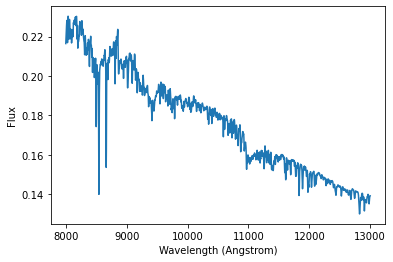

Building models with **paintbox**
---------------------------------

In **paintbox**, the models used to describe the observed spectrum
and/or spectral energy distribution of a galaxy are build from a
combination of spectral components, including the stellar continuum,
emission lines for the gas, etc. Moreover, the parametrization of the
model, i.e., the specific details about how these spectral elements are
combined, are defined interactively. Below, we illustrate how to
generate these spectral components in practice and how to combine them
to make a model.

Using CvD models
~~~~~~~~~~~~~~~~

Here we use the CvD single stellar popupation models, and the response
functions for several elements, prepared in this
`tutorial <https://paintbox.readthedocs.io/en/latest/preparing_models.html#preparing-cvd-models>`__
to illustrate how to create the basic elements for the stellar
continuum.

::

    import os
    
    import numpy as np
    from astropy.io import fits
    from astropy.table import Table
    import matplotlib.pyplot as plt
    
    import paintbox as pb

We first load the data from the CvD models, which are stored in a
multi-extension FITS file, and we create an interpolate version of the
SSP models.

::

    # Reading the content of the FITS file with SSP models
    ssp_file = "templates/VCJ17_varydoublex.fits"
    templates = fits.getdata(ssp_file, ext=0)
    params = Table.read(ssp_file, hdu=1)
    wave = Table.read(ssp_file, hdu=2)["wave"].data
    # Use paintbox to create a component with interpolated SSP models
    ssp = pb.ParametricModel(wave, params, templates)
    # Name of the parameters are taken from the input table params
    print("Parameter names: ", ssp.parnames)
    # Model parameters 
    p0 = np.array([0.1, 6, 2.3, 2.3])
    print("Parameters for example: ", p0)
    fig = plt.subplot(111)
    plt.plot(wave, ssp(p0), "-")
    plt.xlabel("Wavelength (Angstrom)")
    plt.ylabel("Flux")

.. parsed-literal::

    Parameter names:  ['Z', 'Age', 'x1', 'x2']
    Parameters for example:  [0.1 6.  2.3 2.3]

The SSP models contain elemental abundances that have solar values, but
this can be changed with the response functions for each element. In
practice, what we have to do is to multiply the response function by the
base models generated above. Below we illustrate how to modify the
models to the response of sodium, iron, calcium and potassium.

::

    elements = ["Na", "Fe", "Ca", "K"] # 
    for element in elements:
        elem_file = "templates/C18_rfs_{}.fits".format(element)
        rfdata = fits.getdata(elem_file, ext=0)
        rfpar = Table.read(elem_file, hdu=1)
        vmin, vmax = rfpar[element].min(), rfpar[element].max()
        rf = pb.ParametricModel(wave, rfpar, rfdata)
        ssp = ssp * rf

In the example above, we are already combining different **paintbox**
components, producing one that is a multiplication of a SSP with four
different response functions. However, the response functions are also
dependent on the ages and metallicities of the SSP models. Consequently,
the parameter names get repetitive in this case:

::

    print("Parameter names: ", ssp.parnames)

.. parsed-literal::

    Parameter names:  ['Z', 'Age', 'x1', 'x2', 'Z', 'Age', 'Na', 'Z', 'Age', 'Fe', 'Z', 'Age', 'Ca', 'Z', 'Age', 'K']

By default, **paintbox** just concatenate all the parameter names.
However, in this application, we should use the same ages and
metallicities in the model, which can be obtained by constraining the
model as indicated below.

::

    ssp = pb.ConstrainModel(ssp)
    print(ssp.parnames)

.. parsed-literal::

    ['Z', 'Age', 'x1', 'x2', 'Na', 'Fe', 'Ca', 'K']

The ConstrainModel operator allows consistent calls to all parameters
that are repeated.

::

    # Model parameters 
    p1 = np.array([0.1, 6, 2.3, 2.3, 0.05, 0.05, 0.05, 0.05])
    print("Parameters for non-solar abundances: ", p1)
    fig = plt.subplot(111)
    plt.plot(wave, ssp(p1), "-")
    plt.xlabel("Wavelength (Angstrom)")
    plt.ylabel("Flux")

.. parsed-literal::

    Parameters for non-solar abundances:  [0.1  6.   2.3  2.3  0.05 0.05 0.05 0.05]

Emission lines
~~~~~~~~~~~~~~

TBD.

Polynomials
~~~~~~~~~~~

TBD.

