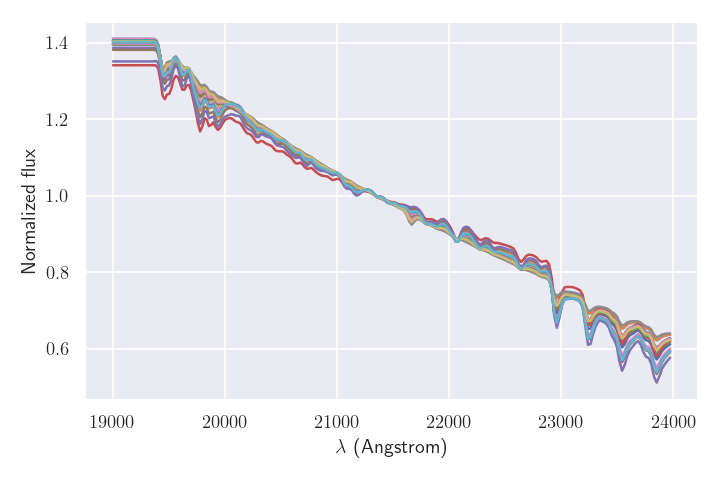

Stellar population models
--------------------------

Paintbox is particularly designed to model the observed spectrum, i.e.,
the flux from stars as a function of the wavelength, of galaxies where
stars are not individually resolved. In these cases, the most important
ingredient to describe the stellar features in observations are stellar
population models, which describe the properties of an emsemble of stars
with different properties, e.g., ages, metallicities, etc. Several
groups of astronomers distribute their models for free for users, either
publicily or under request. However, there is no single standard way of
distributing stellar population models, so we have to prepare the data
from the models *before* using **paintbox**. Moreover, in practical
applications, we also require the models to be tunned according to the
scientific requirements of the modeling as a way to minimize the (often
expensive) number of computations depending on the resolution of the
data.

EMILES
~~~~~~

Stellar populations models from the MILES library can be obtained in a
variety of ways in their
`website <http://research.iac.es/proyecto/miles//pages/stellar-libraries/miles-library.php>`__.
For this example, we will use the packages
`astropy <https://www.astropy.org>`__ to handle FITS fiels and tables,
and the [pPXF](`ppxf <https://pypi.org/project/ppxf/>`__ for rebinning
the data to a logarithmic scale.

::

    import os
    
    import numpy as np
    from astropy.io import fits 
    from astropy.table import Table
    from ppxf import ppxf_util

For this example, we will use a set of single stellar population (SSP)
templates of the E-MILES models (version 11) produced with BASTI
isochrones and assuming a Chabrier initial mass function, which can be
downloaded in a tarball from their public ftp link available `in their
website <http://miles.iac.es/>`__ (EMILES_BASTI_BASE_CH_FITS.tar.gz, 95
Mb). After downloading the data, it is necessary to unpack the tarfile
(preferentially into a subdirectory, which we name emiles_v11),
containing the 636 SSP spectra in this case.

::

    emiles_dir = "/home/kadu/Dropbox/SSPs/emiles_v11"
    w1 = 2600 # Minimum wavelength
    w2 = 10000 # Maximum wavelength

We can use the `MILES name
convention <http://research.iac.es/proyecto/miles/pages/ssp-models/name-convention.php>`__
to read the files with the models.

::

    def miles_filename(specrange, imf, imfslope, metal, age):
        """ Returns the name of a fits file in the MILES library according
        to the name convention. """
        msign = "p" if metal >= 0. else "m"
        azero = "0" if age < 10. else ""
        return "{0}{1}{2:.2f}Z{3}{4:.2f}T{5}{6:02.4f}" \
                "_iTp0.00_baseFe.fits".format(specrange, imf, \
                imfslope, msign, abs(metal), azero, age)

Below we produce a list containing all the spectra that we are going to
use in our analysis (filenames), and we also produce an astropy `Table
object <https://docs.astropy.org/en/stable/api/astropy.table.Table.html#astropy.table.Table>`__
storing the parameters of the files.

::

    specrange = "E" # options: "E", "M", "B", "R", "C"
    imf = "ch" # options: "un", "bi", "ku", "kb", "ch"
    imfslope = 1.3
    # Values of metallicities and ages available for BASTI isochrones
    Zs = np.array([-0.96, -0.66, -0.35, -0.25, 0.06, 0.15,  0.26,  0.4])
    Ts = np.linspace(1., 14., 27) # Using only ages > 1 Gyr
    ssps_grid = np.array(np.meshgrid(Ts, Zs)).T.reshape(-1, 2)
    nssps = len(ssps_grid)
    filenames = []
    for t, z in ssps_grid:
        filenames.append(miles_filename(specrange, imf, imfslope, z, t))
    params = Table(ssps_grid, names=["T", "Z"])

We use the information in the header of one spectrum to determine the
wavelength range (which is always the same for a given set of models).
Notice that the wavelength range covered by the EMILES models is large
(from the near-UV to the IR).

::

    h = fits.getheader(os.path.join(emiles_dir, filenames[0]))
    wave = (h['CRVAL1'] + h['CDELT1'] * (np.arange((h['NAXIS1'])) + 1 - h['CRPIX1']))

Finally, we need to trim and/or rebin the model spectra. We need to trim
the data to cover only the spectral region of the observed data. Notice,
however, that we should always have extra coverage in the models,
preferentially on both edges of the spectra, if we are also modeling the
kynematics of the galaxy, and also to avoid problems at the edges of the
models owing to convolutions (below I use 500 Angstrom, but this can be
optimized for a galaxy according to their redshift). We may also rebin
the data, either to have the same wavelength dispersion of the
observations, or to a logarithmic scale to model the kinematics. We use
the pPXF for this purpose, assuming a velocity scale for the rebinning
of 200 km/s.

::

    velscale = 200
    extra_wave = 500
    idx = np.where((wave >= w1 - extra_wave) & (wave <= w2 + extra_wave))
    wave = wave[idx] # Trimming wavelength array

    # Using first spectrum to get array size after rebbining
    flux = fits.getdata(os.path.join(emiles_dir, filenames[0]))[idx]
    wrange = [wave[0], wave[-1]]
    newflux, logLam, velscale = ppxf_util.log_rebin(wrange, flux,
                                                     velscale=velscale)
    # Loop to trim and rebin spectra
    ssps = np.zeros((nssps, len(newflux)))
    for i, filename in enumerate(filenames):
        flambda = fits.getdata(os.path.join(emiles_dir, filename))[idx]
        flux_log = ppxf_util.log_rebin(wrange, flambda, velscale=velscale)[0]
        ssps[i] = flux_log

Now, we just need to store the processed data into a FITS file.

::

    hdu1 = fits.PrimaryHDU(ssps)
    hdu1.header["EXTNAME"] = "SSPS"
    hdu2 = fits.BinTableHDU(params)
    hdu2.header["EXTNAME"] = "PARAMS"
    hdu3 = fits.BinTableHDU(Table([logLam], names=["loglam"]))
    hdu3.header["EXTNAME"] = "WAVE"
    hdulist = fits.HDUList([hdu1, hdu2, hdu3])
    output = "emiles_chabrier_w{}_{}_vel{}.fits".format(w1, w2, velscale)
    hdulist.writeto(output, overwrite=True)

In this particular example, we will obtain a multi-extension FITS file
named “emiles_chabrier_w2600_10000_vel200.fits”, which contains the 2D
array with the models, a parameter table, and an 1D array with the
wavelength array. Notice that, in practice, if often necessary to
degrade the model spectra to match the resolution of the observations,
which can be performed with the task paintbox.utils.broad2res.

Using CvD stellar population models
~~~~~~~~~~~~~~~~~~~~~~~~~~~~~~~~~~~

Models from the `Conroy and van Dokkum
(2012) <https://ui.adsabs.harvard.edu/abs/2012ApJ...747...69C/abstract>`__
and `Conroy et
al. (2018) <https://ui.adsabs.harvard.edu/abs/2018ApJ...854..139C/abstract>`__,
a.k.a. CvD models, can be obtained under request to the authors, and are
**not** distributed together with ``paintbox``. Similar to the MILES
models, CvD are also distributed as SSP models with varying ages,
metallicities, and IMFs, but also provide response functions that allow
the variation of several individual elements, e.g., C, N, O, Mg, Si, Ca,
Ti, and Fe. To handle these models, we use the utility
class ``CvD18``, built from the basic ``paintbox`` classes, to handle
the input files and produce spectra with any combination of parameters.

::

    import os
    import glob

    import numpy as np
    from paintbox.utils import CvD18, disp2vel
    import matplotlib.pyplot as plt

    # Defining an arbitrary wavelength region
    w1, w2 = 5000, 9000 # Setting the wavelength window
    sigma = 300 # Velocity dispersion of the output models
    wave = disp2vel([w1, w2], sigma)
    outdir = os.path.join(os.getcwd(), "CvD18_tutorials")
    elements = ["Mg", "Na"] # Simple model with only two elements
    ssp = CvD18(wave, sigma=sigma, outdir=outdir, elements=elements)
    # Plotting n random models
    fig = plt.figure(figsize=(8, 6))
    n = 20
    print("Model allowed ranges")
    print(ssp.limits)
    print("List of parameters of model")
    print(ssp.parnames)
    for i in range(n):
        theta = np.array([np.random.uniform(ssp.limits[p][0], ssp.limits[p][1])
                          for p in ssp.parnames])
        v = ssp(theta)
        plt.plot(wave, ssp(theta))
    plt.xlabel("$\lambda$ (Angstrom)")
    plt.ylabel("Normalized flux")
    plt.savefig("../docs/figures/CvD_example.png")
    plt.show()

.. parsed-literal::

    Model allowed ranges
    {'Z': (-1.5, 0.2), 'Age': (1.0, 13.0), 'x1': (0.5, 3.5), 'x2': (0.5, 3.5), 'Mg': (-0.3, 0.3), 'Na': (-0.3, 0.9)}
    List of parameters of model
    ['Z', 'Age', 'x1', 'x2', 'Mg', 'Na']

Please check out the documentation for the ``CvD18`` class to set this
class to work in your computer using the ``libpath`` keyword.

Visualizing response functions
^^^^^^^^^^^^^^^^^^^^^^^^^^^^^^

To ``CvD18`` class allows the access to all response functions used in
an instance. Below we use the response function of iron, magnesium and
titanium to reproduce figure 8 of `Conroy et
al. (2018) <https://ui.adsabs.harvard.edu/abs/2018ApJ...854..139C/abstract>`__.

::

    import os

    import numpy as np
    import paintbox as pb
    from paintbox.utils import disp2vel, CvD18
    import matplotlib.pyplot as plt

    wave = disp2vel([3800, 7000], 100)
    sigma = 300 # Velocity dispersion of the output models
    elements = ["Fe", "Mg", "Ti"]
    outdir = os.path.join(os.getcwd(), "CvD18_tutorials")
    ssp = CvD18(wave, sigma=sigma, outdir=outdir, elements=elements)
    fig = plt.figure(figsize=(12, 8))
    for i, element in enumerate(elements):
        rf = ssp.response_functions[element]
        # Upper panels with fixed metallicity
        Z = 0.2
        abund = rf.limits[element][1]
        ages = [1, 5, 13]
        ax = plt.subplot(2, len(elements), i+1)
        for age in ages:
            theta = np.array([Z, age, abund])
            ax.plot(wave, (rf(theta) - 1) * 100, label=f"{theta}")
            ax.legend(title=f"[Z, age, {element}]", prop={"size": 7})
        ax.set_xlabel("$\lambda$ (Angstrom)")
        ax.set_ylabel("ratio (\%)")
        ax.text(0.12, 0.12, element, fontsize=16, transform=ax.transAxes)
        # Lower panels with fixed age
        age = 5
        Zs = [-1.5, -1, -0.5, 0, 0.2]
        ax = plt.subplot(2, len(elements), i+4)
        for Z in Zs:
            theta = np.array([Z, age, abund])
            ax.plot(wave, (rf(theta) - 1) * 100, label=theta)
        ax.set_xlabel("$\lambda$ (Angstrom)")
        ax.set_ylabel("ratio (\%)")
        ax.legend(title=f"[Z, age, {element}]", prop={"size": 7}, ncol=2)
        ax.text(0.12, 0.12, element, fontsize=16, transform=ax.transAxes)
    plt.tight_layout()
    plt.savefig("../docs/figures/rfs_Fe_Mg_Ti.png")
    plt.show()

